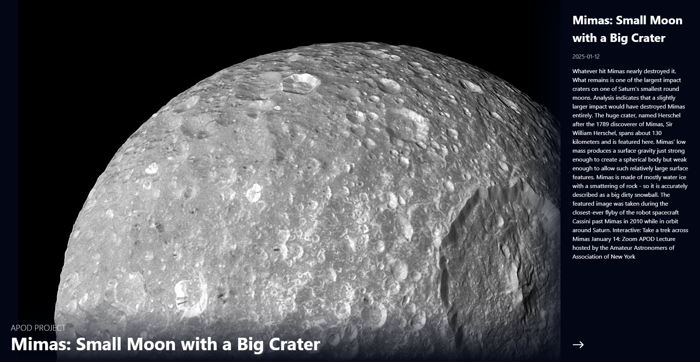

# NASA APOD Web App  

  

## Description  

This web application utilizes the NASA Astronomy Picture of the Day (APOD) API to fetch and display stunning astronomical images along with detailed descriptions. Built with React.js, this app provides users with a daily glimpse into the wonders of our universe.  

## Features  

- Fetches the Astronomy Picture of the Day from the NASA APOD API.  
- Displays the image along with its title and explanation.  
- Responsive design for better viewing on all devices.  

## Technologies Used  

- **React.js**: For building the user interface.  
- **Vite**: A fast development environment for modern web projects.  
- **NASA APOD API**: To fetch astronomical images and metadata.  
- **Tailwind**: For styling and animating the application. 

## Live Preview  

You can view the live application [here](https://react-nasa-api-api.netlify.app/).  

## Installation  

To run this project locally, follow these steps:  

1. Clone the repository:  
   ```bash  
   git clone https://github.com/arbaz93/React-NASA-App.git
   
2. Navigate into the project directory:
   ```bash  
   cd React-NASA-App
   
3. Install the dependencies:
   ```bash  
   npm install
   
4. Start the development server:
   ```bash  
   npm run dev

Your application should now be running on http://localhost:5173

## Acknowledgements

- Special thanks to Nasa for providing [NASA APOD API](https://apod.nasa.gov/apod/)

## License

- This project is licensed under the MIT License - see the [LICENSE](./LICENSE) file for details.

## Contributing

- Contributions are welcome! Please feel free to submit a pull request or open an issue to discuss your ideas.

